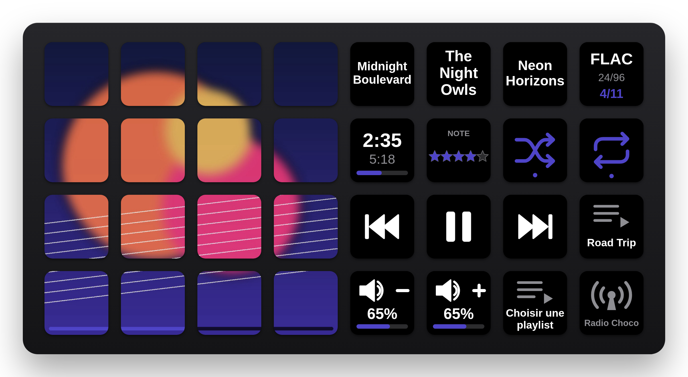

# CariMusicDeck — Caribou Labs

**Plugin Stream Deck pour macOS : pochette, infos et commandes de lecture pour Apple Music, Plex (Plexamp) et CariRadio.**
Chaque touche suit automatiquement la source en cours de lecture ; aucune touche n'est liée à une application.

<p align="center">
  
</p>

> Rendu du profil « CariMusicDeck XL » (pochette de démonstration).

---

## Fonctionnalités

- **Pochette en mosaïque** : posez l'action sur plusieurs touches voisines (2×2, 4×4, 8×4…) ; elles forment
  automatiquement un rectangle et se partagent l'image, en compensant l'espace physique entre les touches.
  Barre de progression continue en option sur la rangée du bas.
- **Multi-source** : Apple Music, Plex (toutes les lectures du serveur, Plexamp piloté en direct) et CariRadio.
  Si plusieurs sources jouent, la dernière lancée l'emporte (ou priorité fixe).
- **Couleur d'accent** extraite de la pochette (barres, étoiles, icônes actives).
- **Profil XL prêt à l'emploi**, proposé à l'installation.

## Actions

| Action | Affichage | Appui | Maintien (400 ms) |
|---|---|---|---|
| Pochette en lecture | pochette, mosaïque automatique, barre de progression (option) | lecture/pause | stop |
| Lecture / Pause | ▶︎ / ❚❚ selon l'état | lecture/pause | stop |
| Précédent / Suivant | ⏮ / ⏭ | piste précédente (début du morceau après 3 s) / suivante | recherche continue (pas réglable) |
| Aléatoire | état | active / désactive | — |
| Répétition | désactivée / tout / un seul | cycle | — |
| Titre | titre, artiste, album ou artiste — titre ; défilement ou taille auto | lecture/pause | stop |
| Infos piste | codec, qualité (24/96, 256 kbps), position (7/14 ou 342/8837) | — | — |
| Temps | écoulé / total ou restant + barre | bascule total / restant | — |
| Note | étoiles (pas de 1 ou ½) ; cœur « Favori » pour Apple Music | +1 pas / favori | — |
| Volume + / − | niveau + barre | ± pas (réglable) | répétition continue ; Volume − en option : sourdine + pause (fondu) |
| Playlist | pochette et nom de la playlist | lance la playlist (aléatoire en option) | — |
| Radio | état de CariRadio (en direct / en pause) | lance CariRadio en lecture, sinon lecture/pause | affiche la fenêtre CariRadio |

## Sources

### Apple Music
Lecture de l'état par AppleScript. Au premier lancement, autoriser **Stream Deck → Musique** dans
*Réglages Système › Confidentialité et sécurité › Automatisation*.
Pochette : bibliothèque locale, sinon catalogue iTunes (titres en streaming dont Music ne fournit pas l'image).

En cas de refus d'autorisation antérieur : `tccutil reset AppleEvents com.elgato.StreamDeck`, puis relancer Stream Deck.

### Plex
- Sessions du serveur (`/status/sessions`) : toutes les lectures musique, quel que soit l'appareil.
- Commandes, volume, aléatoire, répétition et temps précis en direct sur **Plexamp** (API companion, port 32500,
  détection automatique ou « URL lecteur » forcée), repli via le serveur.
- **Se connecter à Plex…** : connexion plex.tv par code PIN et découverte automatique du serveur.
  Filtres optionnels par lecteur et par utilisateur.

### CariRadio
Mini-lecteur Caribou Labs (Radio Choco — Sound HD), piloté par son API locale `http://127.0.0.1:32700`.
Pochette, titre, temps de la piste et volume suivent la radio ; précédent, suivant, aléatoire, répétition
et note sont inactifs (direct).

## Installation

1. Double-cliquer `CariMusicDeck.streamDeckPlugin` (Stream Deck 7.1 ou plus récent, macOS 13+).
2. Accepter l'installation du profil **CariMusicDeck XL** (Stream Deck XL) — ou composer sa propre disposition
   à partir de la catégorie **CariMusicDeck** dans la liste des actions.
3. Dans les réglages d'une touche › *Réglages généraux* : connexion Plex, sources actives, test Apple Music.

## Réglages

| Réglage | Portée | Rôle |
|---|---|---|
| Sources (Apple Music / Plex / CariRadio) | global | active ou ignore chaque source |
| Si les deux jouent | global | dernière lancée, ou priorité fixe |
| Espace inter-touches | global | compensation de l'écart physique dans la mosaïque (à régler à l'œil) |
| Barre de progression | global | barre continue sous la mosaïque |
| Disposition / Texte / Appui | par touche Pochette | mosaïque ou pochette entière, texte Stream Deck, action d'appui |
| Champ / Texte long | par touche Titre | champ affiché, défilement ou réduction |
| Pas, Maintien, Fondu | par touche Volume | pas du volume, répétition ou sourdine, durée du fondu |
| Apple Music : cœur ou étoiles | par touche Note | favori (Music) ou étoiles |

## Développement

```
src/
  plugin.ts     point d'entrée (enregistrement des actions)
  engine.ts     moteur : interrogation des sources, choix de la source active, commandes
  music.ts      Apple Music (AppleScript)
  plex.ts       Plex serveur + lecteur Plexamp
  radio.ts      CariRadio (API locale)
  cover.ts      action Pochette (mosaïque, barre de progression)
  actions.ts    autres actions
  base.ts       classe de base (rendu différentiel, appui court / long)
  render.ts     rendu des pochettes (jimp, JS pur)
  svg.ts        rendu des touches texte et icônes (SVG)
  pi.ts         échanges avec l'inspecteur de propriétés
fr.cariboulabs.caricover.sdPlugin/   manifest, interface (ui/pi.html), images, profil généré
assets/          générateurs d'icônes et du profil XL
docs/            captures du README
```

- **Build** : double-clic sur `build.command` → `release/` (dépendances, vérification TypeScript, bundle esbuild,
  génération du profil, paquet Stream Deck). Aucune suppression de fichier, aucune écriture hors du dossier.
- Identifiant technique du plugin : `fr.cariboulabs.caricover` (conservé depuis les premières versions pour que
  la mise à jour garde les touches configurées et la connexion Plex).
- SDK `@elgato/streamdeck` v3 (Node.js 24 embarqué par Stream Deck).
- Icônes : `python3 assets/make_icons.py fr.cariboulabs.caricover.sdPlugin` (Pillow) et
  `node assets/make_action_icons.mjs <dossier contenant playwright-core>`.

---

Caribou Labs · Nathan Carrillat
